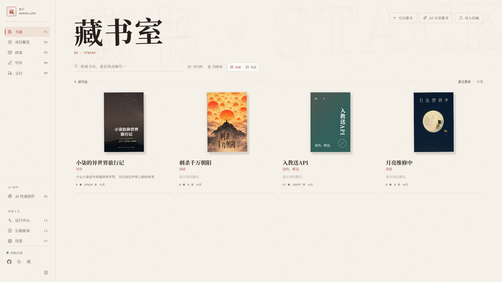
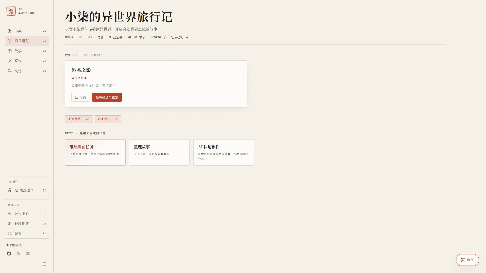
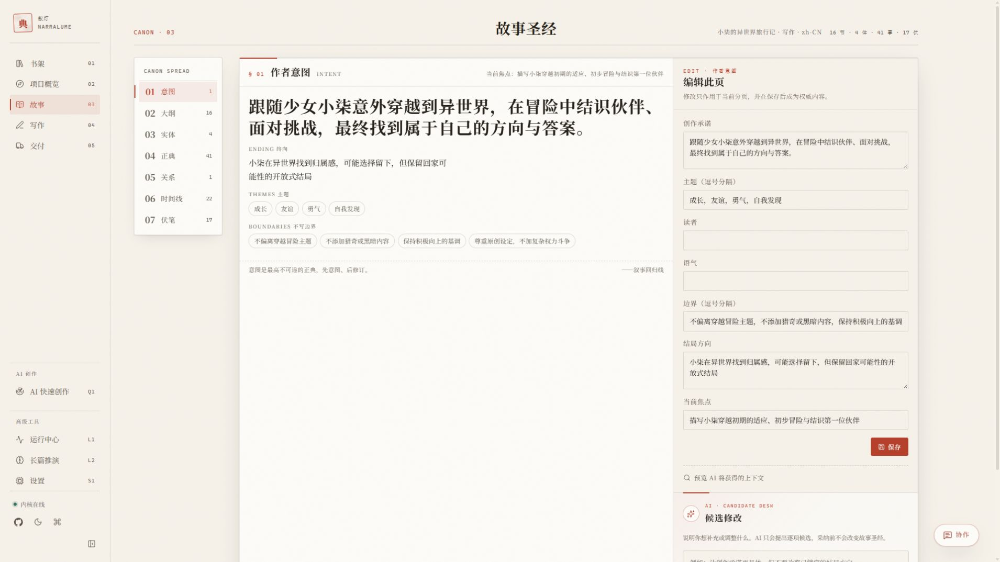
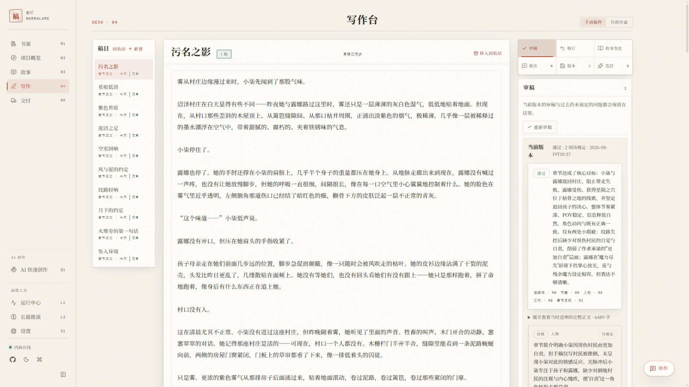
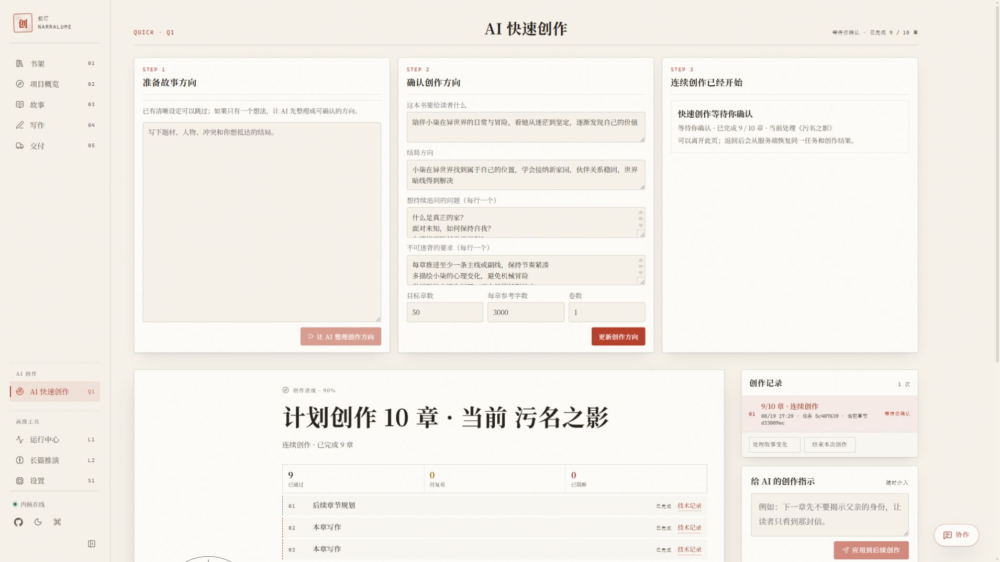
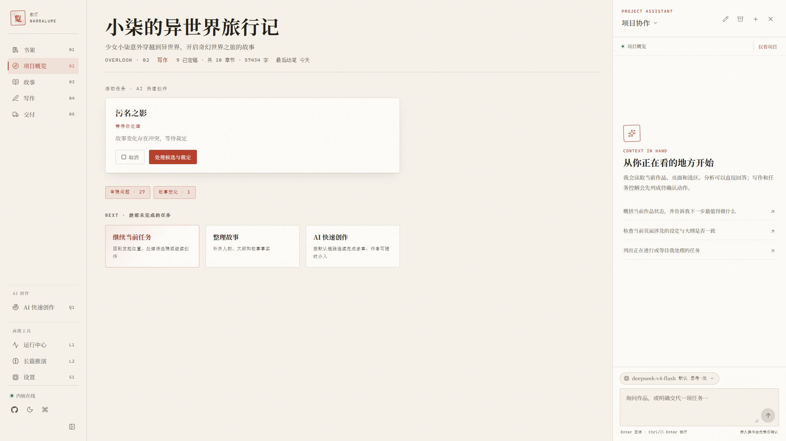
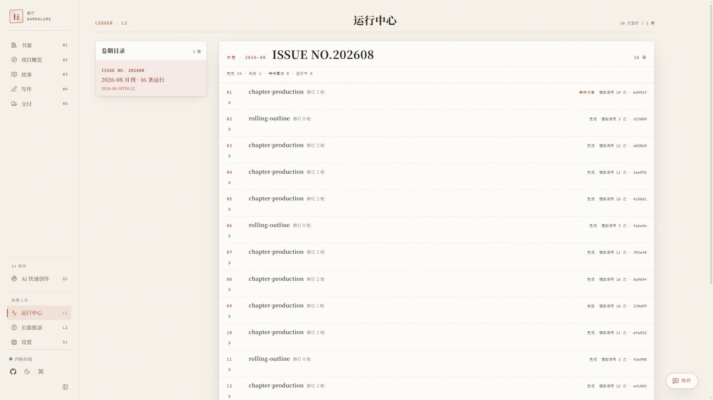
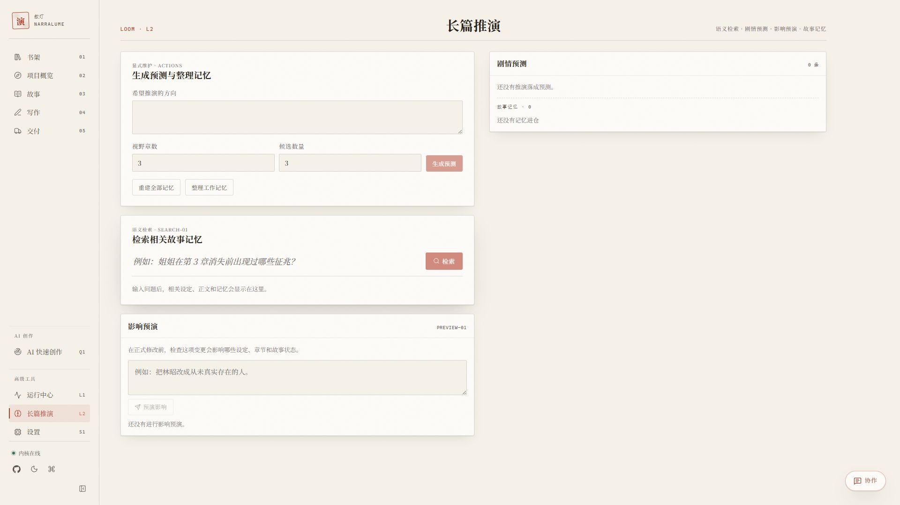
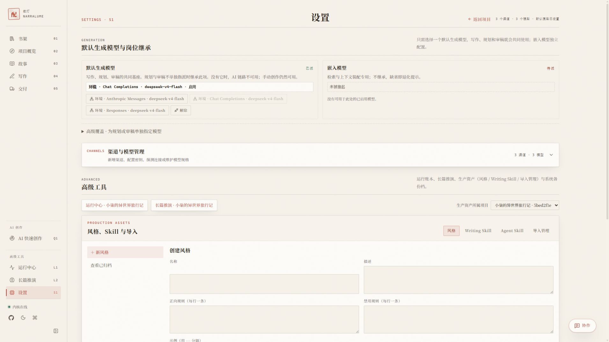
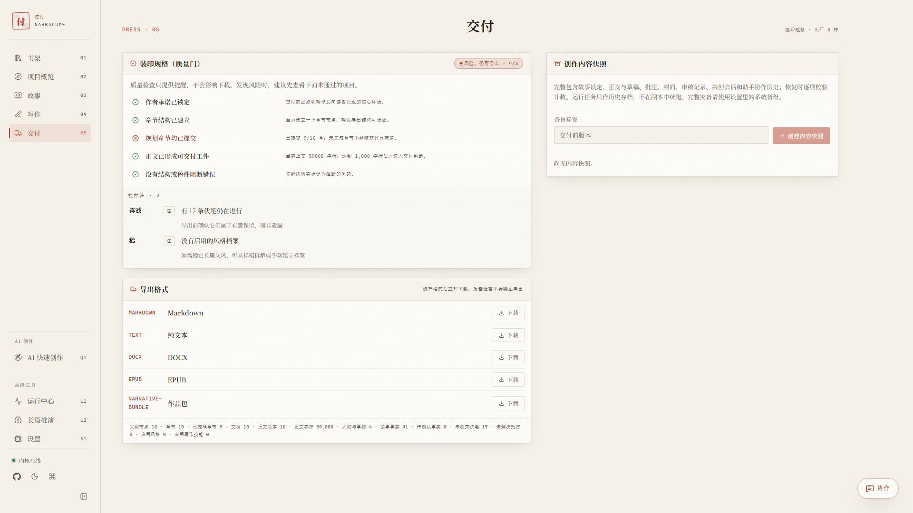

# 用户指南

这份指南按写作过程介绍 NarraLume。你不需要一次读完：通常从书架开始，写到哪一页就看哪一页。界面中的按钮名称用引号标出。

## 先了解三件事

### 没有模型也可以写作

模型只在需要 AI 生成、审稿、故事整理或语义检索时才需要。没有模型时，你仍然可以：

- 新建、导入和管理作品；
- 整理故事意图、大纲、人物、事实、时间线和伏笔；
- 在写作台手写正文、保存版本和批注；
- 导出作品、创建内容快照和下载整库备份。

### AI 先给建议，作者再决定

AI 生成的正文、编辑建议和故事设定变化都会先以候选形式出现。候选不会自动覆盖当前正文，也不会直接改变故事设定。你可以逐项采纳、拒绝或保留，采纳后的内容才成为正式版本。

### 数据取决于运行方式

在线体验使用当前浏览器、当前站点的本地数据库；Windows、macOS、Linux 启动器和源码模式使用本地 Server；Docker 使用自己的数据卷。它们不会因为使用同一个浏览器或同一个项目名称而自动同步。迁移和恢复方法见[数据、隐私与备份](data-and-backup.md)。

## 先认识界面

左侧导航把功能分成三组：书架、项目概览、故事、写作和交付是日常主线；“AI 快速创作”单独放在 AI 创作区；运行中心、长篇推演和设置放在高级工具区。进入作品后，左侧入口始终指向当前作品，不需要回到书架重新选择。

常用的全局入口有：

- 点击左下角的收起按钮，给正文留出更多横向空间；窄屏会自动收起导航。
- 点击太阳或月亮图标切换浅色、深色和跟随系统主题。
- 按 `Ctrl+K`（macOS 为 `Command+K`）打开命令面板，按名称跳转工作区。
- 在作品内按 `Ctrl+J`（macOS 为 `Command+J`）打开或关闭项目协作侧栏。

左下角的“内核在线”表示当前数据驱动可以响应请求，不代表模型渠道一定可用。模型连接需要在“设置”的渠道卡片中单独探测。

## 书架：管理作品

书架是所有作品的入口。每本书显示封面、书名、简介、章节数、字数和最近更新时间。

搜索框会同时匹配书名、副题和卷首语。右上角可以切换封面视图与列表视图；“含归档”只决定是否显示已归档作品，不会改变作品状态。

### 新建作品

点击“空白建书”，填写书名和卷首语，再点击“创建并入藏”。卷首语可以留空，之后在书架的编辑窗口补充。

如果只有一个想法，可以点击“AI 引导建书”，输入题材、人物、冲突或结局方向。AI 会先整理成创作方向候选；确认后再进入项目。这个入口需要已派任的默认生成模型。

### 导入旧稿

点击“导入旧稿”，选择 Markdown、纯文本、DOCX、HTML、EPUB 或 NarraLume 作品包。导入首先生成一个批次和候选清单，不会立即改写故事。

1. 等待文件分析完成。
2. 查看候选的类型、标题和状态，取消不需要的项目。
3. 点击“应用”把选中的内容写入项目，或点击“丢弃批次”。
4. 导入过程中的分析运行可以在“运行中心”回看。

作品包适合迁移一部已经在 NarraLume 中整理过的作品；Markdown、纯文本、DOCX 和 EPUB 适合导入正文或旧稿。导入不会携带模型密钥。

### 封面、复制和归档

在作品的更多操作中可以编辑书名、副题、卷首语和封面。封面支持 JPG、PNG 和 WebP，上传后可以在 3:4 竖版取景框中调整。

“复制”会建立一部独立作品，适合做实验版本或交给合作者。“归档”只从默认书架隐藏作品，不删除内容；打开“含归档”即可查看。

### 回收站

“移入回收站”会把作品保留 30 天。回收站中的作品可以恢复；“永久删除”不可撤销，并且不会进入普通备份恢复流程。删除前请确认已经有可读取的备份。

## 项目概览：知道下一步做什么

进入作品后，默认会看到“项目概览”。这里集中显示：

- 已完成的章节、总字数和最近一次写作时间；
- 正在运行的 AI 任务；
- 待处理的审稿问题和故事变化；
- “继续当前任务”“整理故事”“AI 快速创作”等下一步入口。

任务在后台继续运行时可以离开页面。返回项目后，从概览或任务卡进入原来的处理位置，不要重复提交同一项工作。

## 故事：维护故事资料

“故事”页面也叫“故事设定集”，用七个板块保存会影响后续章节的资料。左侧的板块辑签可以快速切换。

### 作者意图

记录这本书想给读者的核心体验、主题、读者、语气、结局方向、当前焦点和不写边界。它是 AI 规划和审稿时的重要参考，也是你判断候选稿是否跑题的依据。

### 大纲

建立卷、章节和场景的层级结构，填写标题、摘要和章节目标。章节正文可以绑定大纲节点；已绑定或已归档的节点不会再次出现在新建章节列表中。

大纲是写作安排，不是正文。修改大纲不会自动重写已经保存的章节。

### 实体、已确认事实和关系

- “实体”保存人物、地点、组织、物品等对象。
- “事实”保存已经确认的内容，例如人物状态、能力和设定限制。
- “关系”记录人物或实体之间的关系变化和发生时点。

你可以手动编辑这些内容，也可以在相应板块生成 AI 候选。候选面板会逐项显示差异；锁定的事实需要先处理冲突，不能被普通候选静默覆盖。

### 时间线和伏笔

时间线记录故事世界中的事件、时间和说明。伏笔记录埋下、发展、回收或暂时保留的线索。未回收的伏笔不自动视为错误，只有在你决定回收时才会改变状态。

### 故事候选

在“候选修改”中写清楚想补充或调整的内容，例如“让人物动机更具体，但不要改变已锁定的结局”。生成后逐项查看差异，再选择“采纳”或“拒绝”。采纳后才会写入故事资料。

## 写作：从草稿到正式版本

### 创建稿件

在“写作”页面点击“新建”，可以选择：

- 章节正文：绑定一个大纲章节；
- 场景正文：写局部场景，不承担完整章节结算；
- 大纲稿、故事梗概、写作笔记和风格样本：保存辅助资料。

章节正文最好绑定大纲节点。没有对应大纲时，先回到“故事”建立章节。

### 手写和保存版本

正文编辑器使用 Markdown。可以直接输入或粘贴文本，完成后点击“保存新版本”。保存版本会保留当前正文和时间点，之后可以在“版本”面板回看并恢复历史版本。

恢复历史版本不会抹掉其他版本；恢复的内容需要再次保存，才会成为当前正式版本。

### 稿件回收站

写作台右侧的“移入回收站”会隐藏当前稿件，但保留正文、版本、批注和审稿记录。回收站中的稿件不参与新的写作、审稿和导出任务；需要继续使用时，从稿目顶部打开“回收站”并恢复。

稿件回收站和书架回收站不是同一层级。前者只处理一部作品中的稿件，后者处理整部作品；恢复稿件不会改变作品的归档状态。

### 选区、批注和局部编辑

先在正文中选中文字，再打开“选区”工具：

- 在“批注”中记录需要回看的问题。首次对一段文字批注时，系统会同时保存版本锚点。
- 在“AI 编辑指令”中说明目标，例如“减少重复的动作描写，保留紧张感”。点击“生成编辑提案”后，候选会回到写作台。
- 查看差异后，可以采纳、拒绝或继续修改指令。候选不会直接替换正文。

### 交给 AI 写一章

选择章节正文后点击“交给 AI”。AI 会按照当前故事资料和大纲生成章节候选，并执行轻量检查和审稿。完成后从“AI 写作任务”进入候选面板，查看正文、审稿结果和故事变化。

采纳候选后会形成正式正文版本；如果任务失败，先修复模型或网络，再从任务现场选择重试或恢复。已经保存的部分正文会留在任务详情中。

### 审稿和修订

“审稿”面板显示当前版本的审稿结论、评分细项和待裁定问题。问题通常分为人物、连续性、节奏、文句或章节目标等类别。

每个问题都带有证据片段和建议动作。你可以接受、拒绝、标记误报或保留问题。需要修改时，在“修订”面板生成候选，采纳后再保存新版本。

审稿是辅助检查，不是出版许可。最终是否保留一段文字仍由作者决定。

### 故事变化

章节保存或采纳 AI 候选后，系统会整理本章可能改变的人物状态、事实、关系、时间线和伏笔。变化显示在“故事变化”面板中，采纳前不会写入故事资料。

如果变化与锁定事实冲突，面板会暂停在等待裁定状态。先处理冲突，再继续后面的任务。

### 共创沙盒

切换到“共创沙盒”可以建立故事房，配置参与者、发言策略和导演注。共创回合会保存为独立记录，适合头脑风暴、角色对话和场景试写。共创内容在采纳或保存前不会自动进入章节正文。

## AI 快速创作：连续完成多章

“AI 快速创作”适合已经有明确方向、希望一次推进多个章节的情况。它和“交给 AI”共用同一套章节生产流程，但范围更大。

### 三个步骤

1. **准备故事方向**：直接填写想法，或让 AI 从脑暴中整理候选。
2. **确认创作方向**：填写核心承诺、结局方向、主题问题、不可违背的要求、目标章数、每章参考字数和卷数。
3. **开始连续创作**：选择连续创作或逐章确认，再设置规划方式和生成质量。

没有章节细纲时，可以选择“自动执行”，让任务在内部生成轻量计划；需要先看计划时选择“每章规划先确认”。

### 运行期间如何介入

任务卡会显示当前章节、阶段、等待原因和下一步动作。运行期间可以补充方向、暂停、继续、重试或取消。

- 只影响当前章节或后续计划的要求，会在下一个安全节点生效。
- 涉及正文或故事设定的要求，会先生成修订候选或故事变化候选。
- 采纳候选后，后续章节会基于新状态继续。
- 任务发现锁定事实冲突或关键审稿问题时，会停下来等待处理。

在线体验的内置模型对一次快速创作最多开放 3 章；使用自带模型渠道时，以你配置的模型和资源为准。

## 项目助手：用一句话找到入口

在项目内点击右侧的“协作”，可以向助手提问或直接描述目标。助手默认读取当前页面的上下文，例如选中的章节、正文选区或故事板块；上下文条上的切换按钮可以让后续消息只使用项目全局资料。按 `Ctrl+J` 或 `Command+J` 也能打开和关闭侧栏。

适合直接说的事情包括：

- “查看这一章有哪些未解决的审稿问题。”
- “为下一章规划三个可能的冲突。”
- “把这段文字改得更克制，先给我候选。”
- “暂停当前快速创作，保留已经完成的章节。”

每个项目可以建立多条协作对话。顶部菜单用于切换、新建、重命名和归档对话；归档后的对话只读，历史消息、任务活动和关键产物仍然保留。侧栏底部可以为当前对话切换同协议模型和思考档，跨协议切换需要回到“设置”更改默认生成模型。

助手直接回答分析类问题；涉及写作或任务控制时，会先给出待确认动作。正文采纳、故事设定采纳和永久删除仍从对应页面完成，避免在聊天里误操作。

### Writing Skill 与 Agent Skill

- Writing Skill 是写作提示和参考资料，可以按全部、章节、共创、编辑或审稿范围启用。可以在界面中创建和修改，也可以导入、校验或导出 `.skill.zip` 包。
- Agent Skill 是受约束的助手任务包，负责声明触发说明、指令和能力白名单。目前从 ZIP 包导入，可以启停或删除，不能在界面中直接创建和导出。

导入的 Agent Skill 只能使用系统允许的只读或候选型能力，不能执行任意脚本、发起任意网络请求或直接写数据库。正式正文和已确认设定的采纳仍遵守产品内置的确认边界。

## 高级工具

### 运行中心

运行中心按月份整理每次 AI 任务，显示状态、修订轮次和模型调用次数。打开一条运行后，可以查看正文流、步骤与错误、检查点、审稿、有效执行策略、上下文收据、模型快照和调用账本。

页面只显示当前状态允许的操作，例如暂停、继续、接受计划、采纳或丢弃正文、请求修订、重试章节、转为手写和取消。流式生成中断时，已经持久化且达到最低可用长度的部分正文可以继续、采纳、重新生成或丢弃；不要为了恢复任务重新发起一条相同运行。

普通创作遇到失败时，优先从写作台或快速创作任务卡处理；需要核对失败原因、模型用量或部分正文时再进入运行中心。

### 长篇推演

长篇推演提供四类操作：用自然语言检索故事记忆；按方向、预测跨度和候选数量生成剧情预测；重建或整理记忆；在正式修改前预演一项设定变化会影响哪些资料。

预测结果可以采纳为后续参考，也可以搁置；当基础故事资料发生变化时，旧预测会标记为过期。记忆维护和影响预演是分析工具，不会自动改写正文、已确认设定或时间线。

### 设置

设置包含四组内容：

- **模型与岗位**：选择默认生成模型，按需覆盖规划和审稿模型，并单独设置嵌入模型。渠道管理可以新建、编辑、停用和探测渠道及模型。
- **生产资产**：先选择资产所属项目，再维护风格、Writing Skill、Agent Skill 和历史导入批次。风格可以记录正向规则、禁用规则和示例；导入管理可以继续分析、筛选、应用或丢弃旧稿候选。
- **运行驱动**：在自动探测、浏览器本地内核和本地 Server 之间切换。浏览器模式还会显示存储用量、持久存储授权和最近一次整库下载时间。
- **系统备份档**：为本地 Server 创建完整 SQLite 备份，预览哈希、完整性和外键检查，再恢复到一个不同于当前数据目录的新目录。

浏览器内核使用“下载我的库”取得完整 SQLite 文件；本地 Server 模式使用系统备份档或备份脚本。切换运行驱动不会迁移数据，刷新后看到不同作品库是正常现象。

## 交付：导出和留档

### 质量检查

交付页面会检查是否存在正文、章节标题、空稿、未完成任务等情况。质量检查只提供提醒，不会阻止导出，也不会替作者决定内容是否合格。

### 导出格式

- Markdown：适合继续编辑和版本控制；
- 纯文本：适合只需要正文内容的场景；
- DOCX：适合交给 Word 用户继续排版；
- EPUB：适合电子书预览；
- 作品包：包含一部作品的作者可见资料，适合迁移到另一套 NarraLume 环境。

### 项目内容快照

在“交付”中填写标签，点击“创建内容快照”。快照包含作品资料、故事结构、正文版本、批注、审稿、共创和助手历史，但不包含模型密钥。点击“恢复内容副本”会创建一个新项目，不覆盖原项目。

恢复后请核对大纲、最近正文版本、批注、故事变化和运行记录，再决定是否继续写作。

### 完整库备份

浏览器模式在设置中使用“下载我的库”；本地 Server 在 Windows 使用 `scripts/backup.ps1`，在 macOS/Linux 使用 `scripts/backup.sh`；Docker 使用 `scripts/docker-backup.ps1`。完整 SQLite 备份可能包含模型渠道凭据，应和正文一样保存到受控目录。不要在服务运行时直接复制主数据库文件。

## 移动端和桌面端

移动端会把导航收进顶部按钮，工作区改为单列布局。浏览、查看故事资料、处理候选和轻量编辑可以在移动端完成；长篇正文编辑、连续创作和大量导入更适合桌面浏览器。

## 相关文档

- [快速开始](quick-start.md)：启动在线版、Windows、macOS/Linux 和开发环境。
- [配置](configuration.md)：模型协议、环境变量、Docker 和 Bridge/Relay。
- [数据、隐私与备份](data-and-backup.md)：存储位置、作品包、项目快照和整库恢复。
- [Docker Compose](docker.md)：自托管运行、更新、停止和备份。
- [Cloudflare 部署](deploy-cloud.md)：公开 Web、Relay 和 Bridge 的部署边界。
